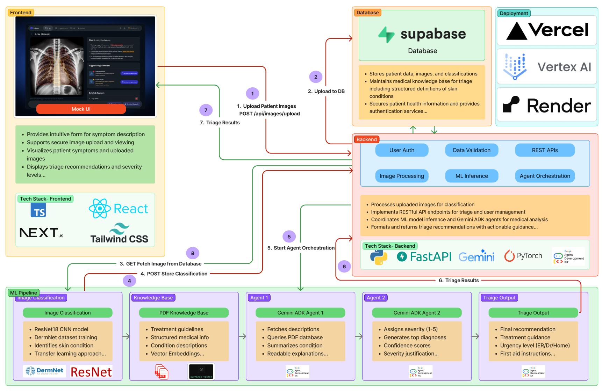
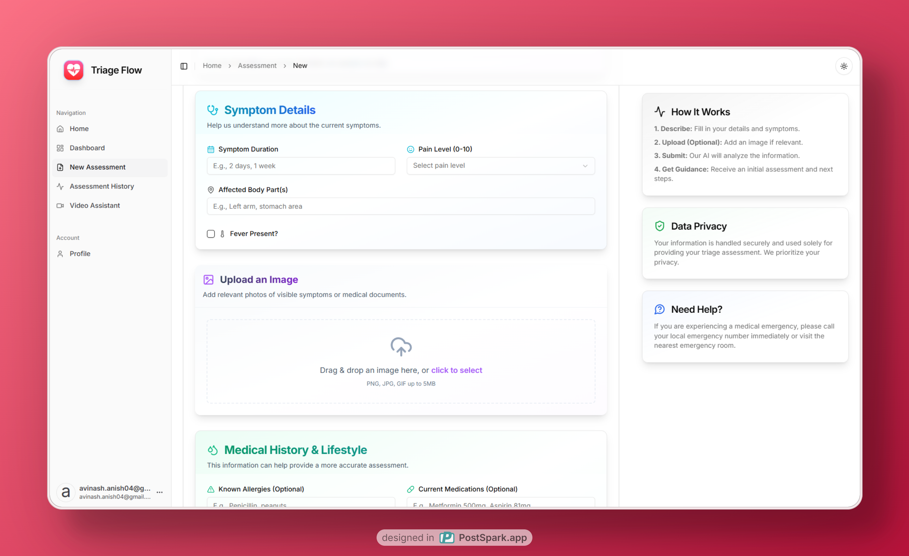
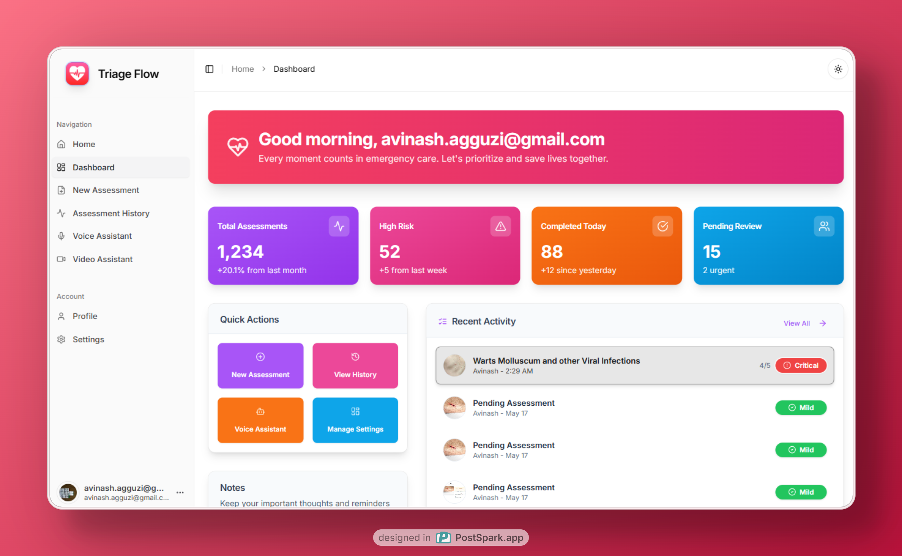
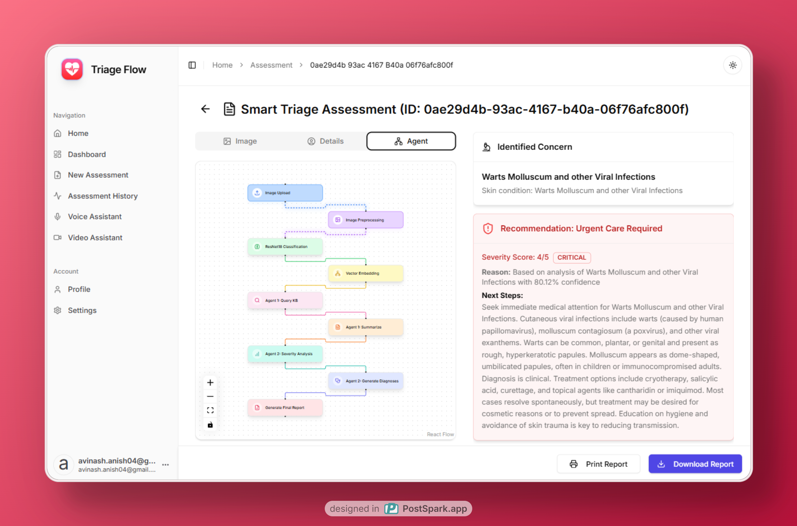
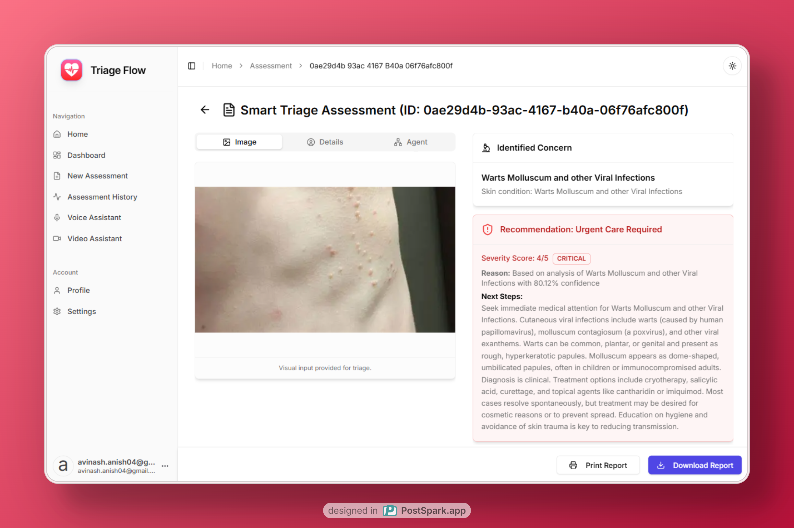
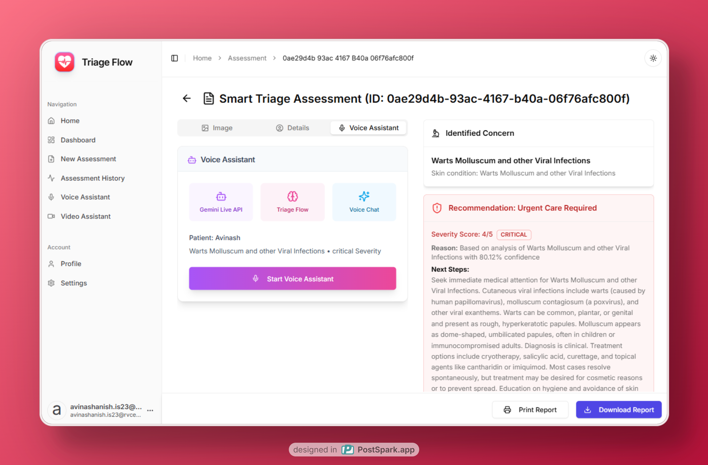
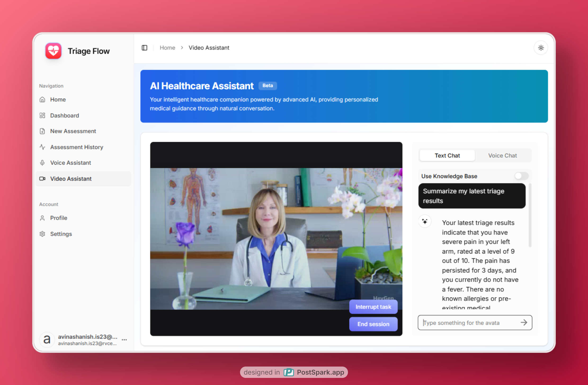

# Triage Flow: AI-Powered Medical Triage System

## Overview

- Triage Flow is an advanced medical triage system designed to assist users and healthcare professionals in assessing symptoms and determining the urgency of medical conditions. 
- It uses a multimodal approach, processing both textual descriptions and uploaded images of conditions, and employs an agentic AI pipeline for accurate analysis and recommendations.

## Architecture

The system is built with a modern tech stack, separating frontend, backend, and ML pipeline concerns for scalability and maintainability.



### Tech Stack:

*   **Frontend:** Next.js, Tailwind CSS, shadcn/ui
*   **Backend:** FastAPI (Python)
*   **Database:** Supabase
*   **AI/ML:**
    *   Image Classification: Tensorflow (ResNet18 fine-tuned on DermNet using transfer learning)
    *   Language Processing & Agentic AI: Google Agent Development Kit (ADK), Gemini API
    *   Knowledge Base: Retrieval Augmented Generation (RAG) with FAISS for vector embeddings from medical PDFs.
    *   Video Assistant: Heygen API
    *   Voice Assistant: Google Gemini Live API
*   **Deployment:**
    *   Frontend: Vercel
    *   Backend: Render

## Features

*   **Multimodal Input Processing:** Upload images of skin conditions along with text descriptions of symptoms. Our system processes both inputs simultaneously using advanced computer vision and natural language understanding.
*   **ResNet Image Classification:** Powered by transfer learning on ResNet18, our image classification model is fine-tuned on the DermNet dataset to accurately identify various skin conditions and injuries.
*   **RAG Knowledge System:** Our retrieval-augmented generation system uses a structured medical PDF knowledge base to provide accurate, up-to-date information about identified conditions.
*   **Gemini ADK Agent 1 (Information Retrieval & Summarization):** The first AI agent in our pipeline specializes in retrieving and summarizing medical descriptions, translating technical terms into clear, understandable language.
*   **Gemini ADK Agent 2 (Severity Assessment):** Our second agent analyzes the compiled information to assign evidence-based severity scores (1-5), providing clear reasoning and confidence levels for each assessment.
*   **Voice Assistant:** Interact with our AI system through voice commands. Describe your symptoms naturally, and let our voice assistant guide you through the assessment process.
*   **Video Consultation:** Connect with healthcare assistant through Heygen Avatars to get real-time assistance.
*   **User Authentication:** Secure user accounts and data management via Supabase.
*   **Triage History:** Users can view their past triage assessments.

## Screenshots

Here are some glimpses of the Triage Flow application:

*Triage Form: Upload images and describe symptoms.*


*Dashboard View: Overview of user information.*


*Triage Agent Flow: Visualization of the AI agent process (example from ResNet description).*


*Triage Output: Detailed results and recommendations.*


*History View: Past triage assessments.*


*Voice Assistant Interface.*


*Video Consultation Interface.*


## Getting Started

### Prerequisites

*   Node.js (v18 or later recommended for Next.js)
*   Python (v3.9 or later recommended)
*   Supabase project (https://supabase.com/)
*   Google Cloud Project with Gemini API enabled
*   Heygen API key (https://heygen.com/)
*   OpenAI API key (https://openai.com/)
*   Resend API key (https://resend.com/)

### Setup

1.  **Clone the repository:**
    ```bash
    git clone https://github.com/CubeStar1/triage-flow.git
    cd triage-flow
    ```

### Frontend Setup (`frontend` directory)

1.  **Navigate to the frontend directory:**
    ```bash
    cd frontend
    ```
2.  **Install dependencies:**
    ```bash
    npm install
    ```
3.  **Set up environment variables:**
    Create a `.env.local` file in the `frontend` directory and add the following variables or copy the content of `frontend/env.example`:
    ```env
    # Supabase
    NEXT_PUBLIC_SUPABASE_URL= <your_supabase_project_url>
    NEXT_PUBLIC_SUPABASE_ANON_KEY= <your_supabase_anon_key>
    SUPABASE_ADMIN= <your_supabase_admin_key>

    # Resend for email verification
    RESEND_API_KEY= <your_resend_api_key>
    RESEND_DOMAIN= <your_resend_domain>

    # App name and icon
    NEXT_PUBLIC_APP_NAME=Triage Flow
    NEXT_PUBLIC_APP_ICON='/logos/health-triage-logo.png'

    # API base URL and WebSocket URL
    NEXT_PUBLIC_API_BASE_URL=https://triage-flow.onrender.com (replace with http://localhost:8000)

    # WebSocket URL for backend
    NEXT_PUBLIC_WS_URL=wss://gemini-live-yjug.onrender.com/ws (replace with ws://localhost:8001/ws)

    # Heygen and OpenAI API keys
    HEYGEN_API_KEY=<your_heygen_api_key>
    OPENAI_API_KEY=<your_openai_api_key>

    ```
4.  **Run the development server:**
    ```bash
    npm run dev
    ```
    The frontend will be available at `http://localhost:3000`.

### Backend Setup (`backend` directory)

1.  **Navigate to the backend directory (from the project root):**
    ```bash
    cd backend
    ```
2.  **Create a virtual environment (recommended):**
    ```bash
    python -m venv venv
    source venv/bin/activate  
    # On Windows: venv\Scripts\activate
    ```
3.  **Install package and dependencies:**
    *   First, install the agent package:
        ```bash
        cd backend/version_3_multi_agent
        pip install -e .
        cd .. 
        ```
    *   Then, install the remaining requirements:
        ```bash
        cd .. 
        pip install -r requirements.txt
        ```
    The `requirements.txt` includes:
    ```
    google-adk
    tensorflow
    faiss-cpu
    fastapi
    google-generativeai
    sentence-transformers
    supabase
    python-dotenv 
    gdown
    ```

4.  **Set up environment variables:**
    Create a `.env` file in the `backend` directory and add the following or copy the content of `backend/env.example`:
    ```env
    SUPABASE_URL=<your_supabase_project_url>
    SUPABASE_KEY=<your_supabase_service_role_key>
    GOOGLE_API_KEY=<your_google_gemini_api_key>
    MODEL_GDRIVE_ID=19Zcav3YPYkh4JnFgMUkSayVwuUaWCgmh
    ```
5.  **Run the backend server:**
\    ```bash
    cd backend
    uvicorn api.triage_endpoint:app --host 0.0.0.0 --port 8000 --reload
    ```
    The backend API will be available at `http://localhost:8000`.

6. **Database Setup**
    - Navigate to `frontend/lib/supabase/migrations`
    ```bash
    cd /frontend/lib/supabase/migrations 
    ```
    - Copy the content of `schema.sql` and paste it into the Supabase SQL editor.
    - Run the SQL query in the Supabase SQL editor to set up the database.

7.  **WebSocket Setup**
    - Refer to https://github.com/CubeStar1/gemini-live-server for more details
    ```bash
    git clone https://github.com/CubeStar1/gemini-live-server.git
    cd gemini-live-server
    ```
    - Set up environment variables:
    ```bash
    cp .env.example .env
    ```
    - Run the server:
    ```bash
     uvicorn main:app --host 0.0.0.0 --port 8001 --reload
    ```
    - The server will be available at `http://localhost:8001`.

    

## Usage

1.  Ensure both frontend and backend servers are running.
2.  Open your browser and navigate to `http://localhost:3000`.
3.  Register or log in to your account.
4.  Use the interface to submit symptoms and images for triage.


